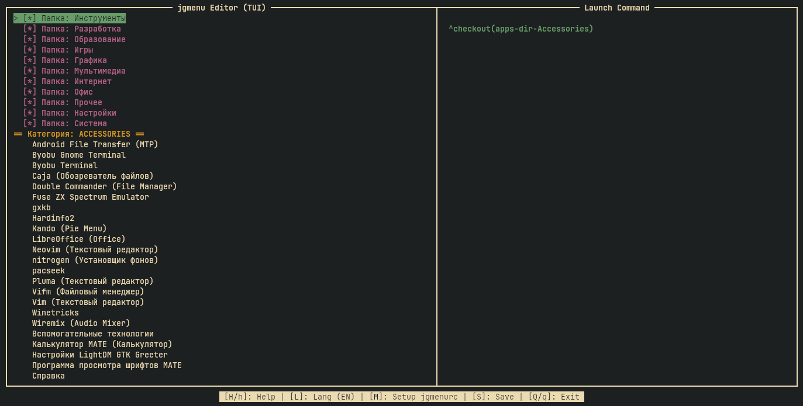
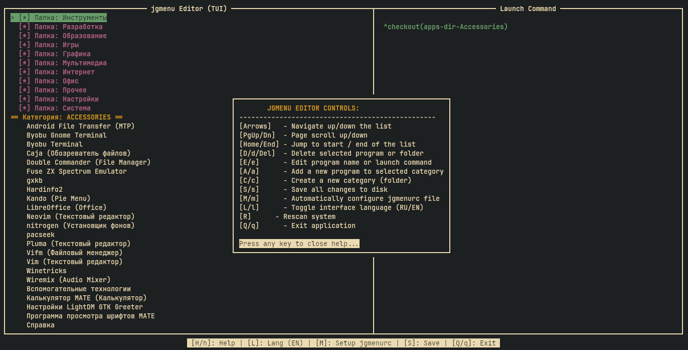
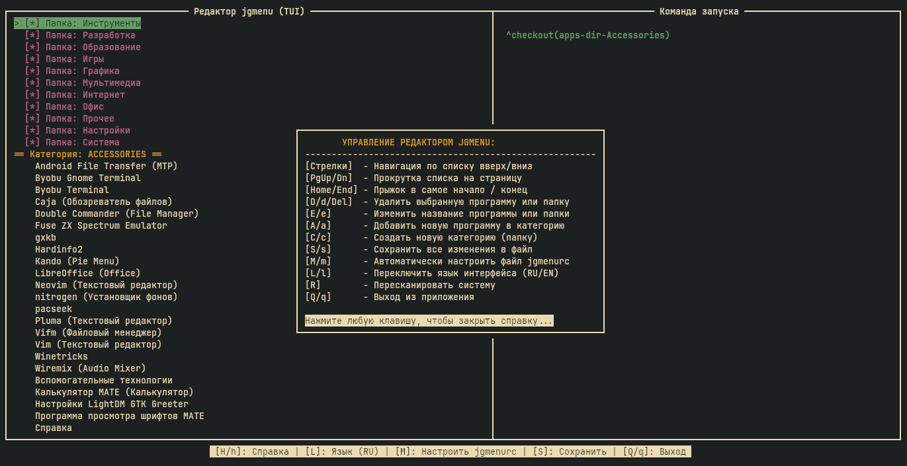
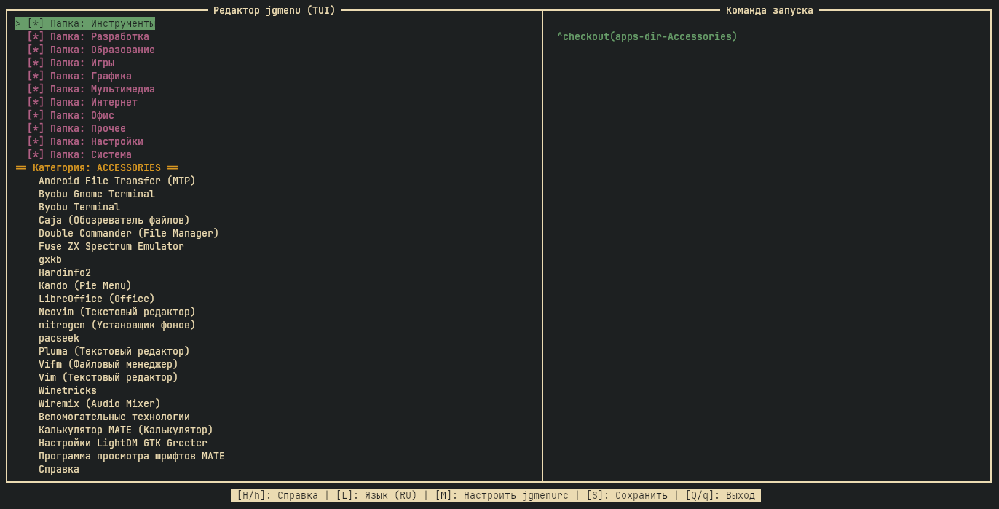

# jgui (v0.3.0) — Interactive TUI Editor for jgmenu


## Screenshots
[](screenshots/01.png) [](screenshots/02.png)
[](screenshots/03.png) [](screenshots/04.png)

[English](#english) | [Русский](#русский)

---

## English

`jgui` is a lightweight, interactive Terminal User Interface (TUI) menu editor for `jgmenu` [multiple-choice-questions]. It is designed specifically for standalone window managers (like i3wm, bspwm, awesomewm) running on Arch Linux. 

It allows you to safely clean up bloated application menus (including conflicting MATE/KDE items), add custom launch commands, and create new folders right from your terminal without modifying system-wide files.

### Key Features
* 📦 **Zero Dependencies:** Written in pure Python using the standard `curses` library.
* 📂 **Safe Multi-user Editing:** Modifies menu files inside your home directory only. Your customized tree won't affect other users on the system.
* 🔄 **Smart Config Generation:** Automatically creates and hooks up `jgmenurc` configuration.
* 🌐 **On-the-fly Localization:** Automatically detects system language (RU/EN) and allows switching layout on the fly.
* 🖥️ **Side Panel view:** Displays the underlying bash launch command for the currently highlighted application.

### Installation & Usage

1. Clone the repository and make the script executable:
```bash
git clone https://github.com
cd jgui
chmod +x jgui
```

2. Symlink it to your local binary folder for global system execution:
```bash
sudo ln -sf \$(pwd)/jgui /usr/local/bin/jgui
```

3. Run it from your terminal:
```bash
jgui
```

### CLI Arguments
* `jgui -v` / `jgui --v` — Show application version.
* `jgui -h` / `jgui --h` — Show brief help message.

---

## Русский

`jgui` — это легковесный интерактивный консольный редактор (TUI) для меню `jgmenu`. Утилита создана специально для независимых оконных менеджеров (i3wm, bspwm, awesomewm) в Arch Linux.

Она позволяет быстро навести порядок в меню, скрывая мусорные дубликаты (оставшиеся от тяжелых сред вроде MATE или KDE), добавлять свои команды и создавать новые папки (категории) прямо в терминале, не ковыряя системные файлы вручную.

### Основные возможности
* 📦 **Ноль зависимостей:** Написан на чистом Python с использованием встроенной библиотеки `curses`.
* 📂 **Безопасно для других пользователей:** Изменяет файлы меню строго внутри вашего домашнего каталога, сохраняя настройки для других пользователей ПК.
* 🔄 **Авто-настройка конфигурации:** Сам генерирует и правильно связывает параметры внутри `jgmenurc`.
* 🌐 **Умная локализация:** Автоматически подхватывает системный язык (RU/EN) и позволяет переключать его на лету.
* 🖥️ **Боковая панель:** В реальном времени выводит точную bash-команду запуска для выбранного пункта.

### Установка и Запуск

1. Клонируйте репозиторий и сделайте скрипт исполняемым:
```bash
git clone https://github.com
cd jgui
chmod +x jgui
```

2. Создайте символическую ссылку в системную директорию для быстрого вызова:
```bash
sudo ln -sf \$(pwd)/jgui /usr/local/bin/jgui
```

3. Запустите утилиту:
```bash
jgui
```

### Аргументы командной строки
* `jgui -v` / `jgui --v` — Показать текущую версию утилиты.
* `jgui -h` / `jgui --h` — Вывести краткую справку на английском языке.
